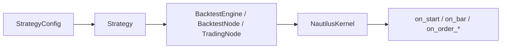

# Python strategy development — orientation

Write a `Strategy` once; run it under `BacktestEngine` / `BacktestNode` or `TradingNode`
with the same handlers. Python is the control plane; the Rust core does the hot work.

## Mental model



1. Define frozen `StrategyConfig` + `Strategy` subclass.
2. In `__init__`, call `super().__init__(config)` and create indicators / fields only.
3. In `on_start`, resolve instrument from cache, subscribe/request data, register indicators.
4. In data handlers (`on_bar`, …), decide; build orders with `self.order_factory`; `submit_order`.
5. Optionally handle fills / positions; clean up in `on_stop`.
6. Wire the same class into a backtest or live node.

## Minimal skeleton

```python
from nautilus_trader.config import StrategyConfig
from nautilus_trader.trading.strategy import Strategy
from nautilus_trader.model.data import Bar
from nautilus_trader.model.enums import OrderSide


class MyConfig(StrategyConfig, frozen=True):
    instrument_id: ...  # InstrumentId
    bar_type: ...       # BarType
    trade_size: ...     # Decimal


class MyStrategy(Strategy):
    def __init__(self, config: MyConfig) -> None:
        super().__init__(config)
        # fields / indicators only — no clock, log, or order_factory here

    def on_start(self) -> None:
        self.instrument = self.cache.instrument(self.config.instrument_id)
        if self.instrument is None:
            self.log.error("instrument missing")
            self.stop()
            return
        self.subscribe_bars(self.config.bar_type)

    def on_bar(self, bar: Bar) -> None:
        if not self.indicators_initialized():
            return
        order = self.order_factory.market(
            instrument_id=self.config.instrument_id,
            order_side=OrderSide.BUY,
            quantity=self.instrument.make_qty(self.config.trade_size),
        )
        self.submit_order(order)

    def on_stop(self) -> None:
        self.cancel_all_orders(self.config.instrument_id)
        self.close_all_positions(self.config.instrument_id)
```

## Which runner?

| Runner | When |
| --- | --- |
| `BacktestEngine` | In-memory data, scripts, parameter sweeps |
| `BacktestNode` | Parquet catalog / streaming, multi-run configs |
| `TradingNode` | Live or sandbox with venue adapters |

## First files to open

| What | Where |
| --- | --- |
| Canonical example strategy | `nautilus_trader/examples/strategies/ema_cross.py` |
| Blank template | `nautilus_trader/examples/strategies/blank.py` |
| Tutorial ladder | `examples/backtest/example_01_…` → `example_11_…` |
| Full backtest script | `examples/backtest/crypto_ema_cross_ethusdt_trade_ticks.py` |
| Live node script | `examples/live/binance/binance_spot_ema_cross_bracket_algo.py` |
| Official concept page | `docs/concepts/strategies.md` |

## Next

- Deep dive: [01_deep_dive.md](01_deep_dive.md)
- Code map: [02_code_map.md](02_code_map.md)
- Engine runtime: [../02_trading_engine/00_orientation.md](../02_trading_engine/00_orientation.md)
