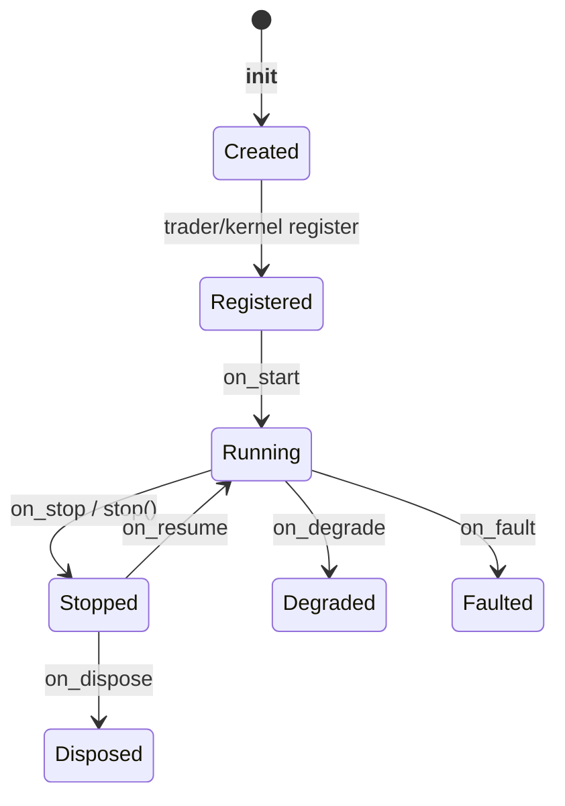

# Python strategy development — deep dive

Canonical reference: [`docs/concepts/strategies.md`](../../docs/concepts/strategies.md).
This page is the narrative + gotchas for building strategies in the v1 package.

## Inheritance and capabilities

`Strategy` inherits `Actor`. Actors own data/lifecycle; strategies add order management.

| Layer | Gives you |
| --- | --- |
| `Actor` | Cache, portfolio facade, clock, logging, data request/subscribe, timers, `on_*` data handlers |
| `Strategy` | `OrderFactory`, `submit_order` / modify / cancel / close helpers, order & position event handlers |

Strategies can run in any environment context (`backtest`, `sandbox`, `live`) once registered
on a node that builds a `NautilusKernel`.

## Config pattern

Use a frozen msgspec-style `StrategyConfig` subclass. Pass it into `super().__init__(config)`.

```python
class EMACrossConfig(StrategyConfig, frozen=True):
    instrument_id: InstrumentId
    bar_type: BarType
    trade_size: Decimal
    fast_ema_period: PositiveInt = 10
    # ...
```

Why config objects matter:

- Importable / serializable for `BacktestNode` multi-runs and live deployments.
- Keeps constructor free of magic globals.
- Same strategy class can be instantiated with different configs without code changes.

See `nautilus_trader/trading/config.py` for `StrategyConfig`, `ImportableStrategyConfig`,
`StrategyFactory`.

## Lifecycle



### Registration vs `__init__`

Wiring (`clock`, `logger`, `msgbus`, `cache`, `portfolio`, `order_factory`) happens at
**registration**, not in `__init__`.

**Do not** call `self.clock`, `self.log`, or `self.order_factory` in `__init__`. That is the
most common strategy crash for newcomers.

Safe in `__init__`: validate config, create indicators, set plain fields to `None`/defaults.

### Stateful handlers

| Handler | Typical use |
| --- | --- |
| `on_start` | Resolve instruments, register indicators, `request_*` / `subscribe_*`, set timers |
| `on_stop` | Cancel orders, close positions, unsubscribe |
| `on_resume` | Re-subscribe after pause |
| `on_reset` | Clear indicators / local state for another run |
| `on_dispose` | Final cleanup |
| `on_save` / `on_load` | Persist/restore user state (`dict[str, bytes]`) |
| `on_degrade` / `on_fault` | React to degraded/faulted component states |

### Data handlers

Implement only what you need: `on_bar`, `on_quote_tick`, `on_trade_tick`, `on_order_book`,
`on_order_book_deltas`, `on_data` (custom), `on_signal`, `on_historical_data`, option/greeks
handlers, etc.

Bars: prefer `request_bars(..., callback=lambda _: self.subscribe_bars(...))` so the live
stream starts after history loads (important with `validate_data_sequence=True`). See
[`docs/concepts/data/index.md`](../../docs/concepts/data/index.md).

### Order and position handlers

Dispatch order is **most specific → general**:

1. `on_order_filled` (or other specific)
2. `on_order_event`
3. `on_event`

Same pattern for positions: `on_position_opened` / `changed` / `closed` → `on_position_event`
→ `on_event`.

After `on_stop`, the strategy is `Stopped`. Fill/position handlers **do not** fire for events
from shutdown closes — put reactive exit logic *before* `on_stop` returns, or accept that
shutdown fills are logged only.

## Orders

### OrderFactory

Created on register. Common builders: `market`, `limit`, `stop_market`, `stop_limit`,
`market_to_limit`, trailing variants, `bracket`, `create_list`.

```python
order = self.order_factory.market(
    instrument_id=self.config.instrument_id,
    order_side=OrderSide.BUY,
    quantity=self.instrument.make_qty(self.config.trade_size),
)
self.submit_order(order)
```

Use instrument helpers (`make_qty`, `make_price`) so precision matches the venue instrument.

### Submit path (strategy view)

`submit_order` publishes commands/events on the message bus. Routing branches:

- Emulated orders → `OrderEmulator`
- `exec_algorithm_id` set → `ExecAlgorithm`
- Else → `RiskEngine` → `ExecutionEngine` → venue client / simulated exchange

Full diagram: [engine deep dive](../02_trading_engine/01_deep_dive.md) and
[`docs/concepts/execution.md`](../../docs/concepts/execution.md).

### Management helpers

`modify_order`, `cancel_order`, `cancel_orders`, `cancel_all_orders`, `close_position`,
`close_all_positions`, `query_order`, `query_account`.

Config flags on example strategies (e.g. `close_positions_on_stop`, `reduce_only_on_stop`)
encode common shutdown policy — copy the pattern rather than inventing ad-hoc teardown.

## Clock and timers

`self.clock.utc_now()` / `timestamp_ns()` for time.
`set_time_alert` / `set_timer` fire `TimeEvent`s into `on_event` (live: possible µs delay).

In backtests the clock is a `TestClock` advanced by the engine; in live it is a `LiveClock`.
Strategy code should not branch on that — use the clock API only.

## Indicators

Register indicators so the framework updates them:

```python
self.register_indicator_for_bars(self.config.bar_type, self.fast_ema)
```

Gate trading on `self.indicators_initialized()` until warm-up completes.

## Backtest vs live wiring

### BacktestEngine (low-level)

```text
BacktestEngineConfig → BacktestEngine
  → add_venue → add_instrument → add_data
  → add_strategy(MyStrategy(config))
  → run() → dispose()
```

Best for: CSV/in-memory ticks, teaching, sweeps. Example:
`examples/backtest/crypto_ema_cross_ethusdt_trade_ticks.py`.

### BacktestNode (high-level)

```text
BacktestRunConfig(s) → BacktestNode(configs).run()
```

Best for: catalog/Parquet streaming and batch configs. Example:
`examples/backtest/tardis_option_chain.py`.

### TradingNode (live)

```text
TradingNodeConfig → TradingNode
  → add strategy / exec algorithms
  → add_data_client_factory / add_exec_client_factory
  → build() → run() → dispose()
```

Use `LiveDataEngineConfig` / `LiveExecEngineConfig` / `LiveRiskEngineConfig` only in live.
Example: `examples/live/binance/binance_spot_ema_cross_bracket_algo.py`.

Research-to-live parity: **same strategy class**; only the node, clients, and engine configs change.

## OMS and identity gotchas

- **`order_id_tag`** must be unique among strategies under one `TraderId`.
- **OMS type** (`NETTING` vs `HEDGING`) on the venue (and strategy expectations) controls how
  `ExecutionEngine` assigns `position_id`s. Mismatch causes confusing position events — set
  deliberately in `add_venue` / live client config.
- Messages are **immutable** after creation; mutate local strategy state, not events.

## v1 vs v2

| | v1 | v2 |
| --- | --- | --- |
| Package | `nautilus_trader/` | `python/` |
| Bindings | Cython + Rust | PyO3-first |
| Strategy tutorials | Use these | Still porting |
| Build | `make build-debug` | `make build-debug-v2` |

Prefer v1 for strategy development unless you are explicitly working on v2.

## Checklist before running live

1. Strategy runs cleanly in backtest on realistic data.
2. `on_start` fails closed if instrument missing (`stop()`).
3. `on_stop` cancels/closes with the intended reduce-only policy.
4. No trading before `indicators_initialized()` (if using indicators).
5. OMS / account type match the venue product (spot CASH vs futures MARGIN, etc.).
6. Live engine configs are `Live*` variants; reconciliation settings reviewed.
7. Example strategies are **not** alpha — treat them as wiring templates only.

## Next

- Code map: [02_code_map.md](02_code_map.md)
- Engine: [../02_trading_engine/01_deep_dive.md](../02_trading_engine/01_deep_dive.md)
