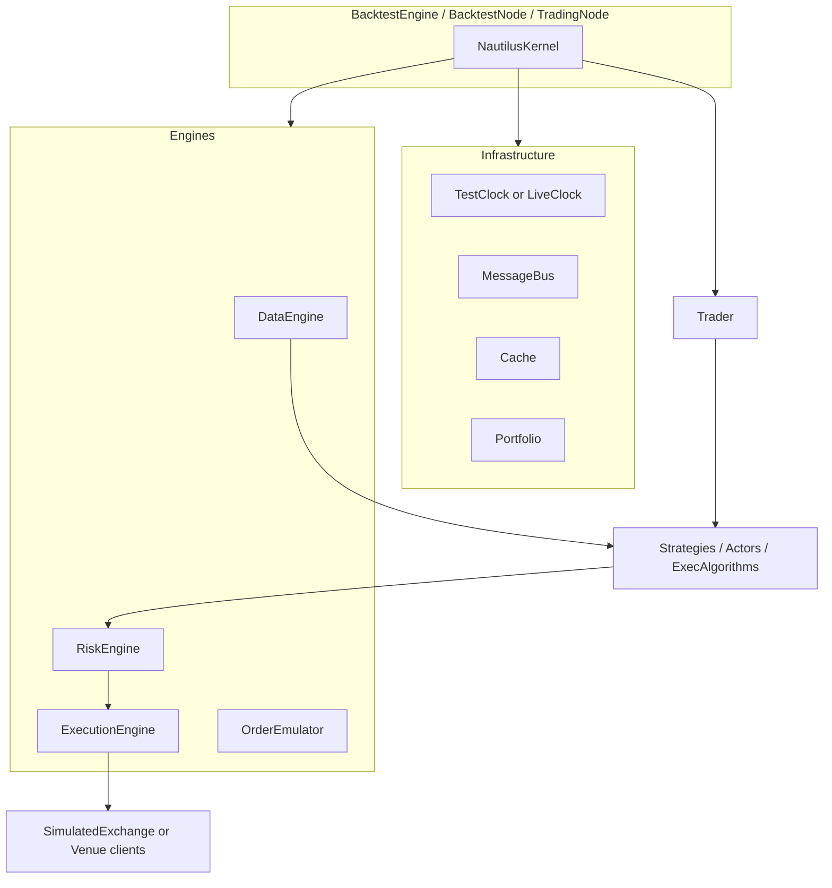

# Trading engine — orientation

A Nautilus **node** builds one `NautilusKernel`. The kernel wires shared infrastructure
(clock, logging, message bus, cache, portfolio) and the core engines, then a `Trader`
registers actors, strategies, and execution algorithms. Backtest and live differ mainly
in clock type, engine variants, and whether venues are simulated or adapter-backed.

## Big picture

## Environments

| Environment | Clock | Data/Exec/Risk engines | Venue side |
| --- | --- | --- | --- |
| `backtest` | `TestClock` | Non-live configs | `SimulatedExchange` per venue |
| `sandbox` | `LiveClock` | Live configs | Simulated execution + real (or recorded) data |
| `live` | `LiveClock` | `Live*Engine` | Adapter data + exec clients |

Config mismatch (e.g. `LiveDataEngineConfig` in backtest) is rejected by the kernel.

## Runtime in one paragraph

Market data enters the **DataEngine** and is dispatched to subscribed strategies (`on_bar`,
…). Strategies send order **commands** on the **MessageBus**. Commands usually pass
**RiskEngine** → **ExecutionEngine** → venue client (or simulated exchange). Fills and
other **events** flow back through the execution engine into the cache/portfolio and into
strategy handlers. In backtests, each data timestamp runs exchange matching **before**
strategy data callbacks, then **settles** new commands until the cascade is quiet.

## Where to look first

| Concern | Start |
| --- | --- |
| Kernel bootstrap | `nautilus_trader/system/kernel.py` |
| Backtest loop / settle | `docs/concepts/backtesting/execution-flow.md` |
| Execution routing | `docs/concepts/execution.md` |
| Architecture overview | `docs/concepts/architecture.md` |

## Next

- Deep dive: [01_deep_dive.md](01_deep_dive.md)
- Code map: [02_code_map.md](02_code_map.md)
- Strategy flow: [../01_python_strategy_dev/00_orientation.md](../01_python_strategy_dev/00_orientation.md)
