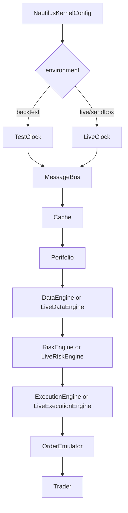
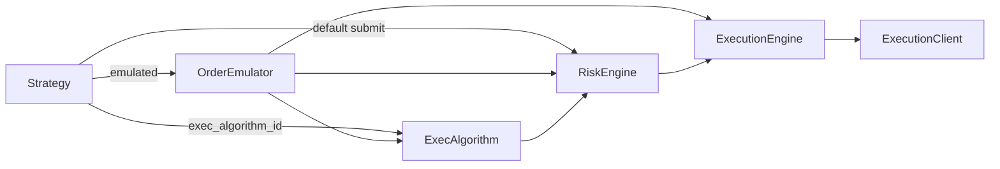

# Trading engine — deep dive

Canonical references:

- [`docs/concepts/architecture.md`](../../docs/concepts/architecture.md)
- [`docs/concepts/execution.md`](../../docs/concepts/execution.md)
- [`docs/concepts/message_bus.md`](../../docs/concepts/message_bus.md)
- [`docs/concepts/backtesting/execution-flow.md`](../../docs/concepts/backtesting/execution-flow.md)
- [`docs/concepts/live.md`](../../docs/concepts/live.md)

## Kernel bootstrap

`NautilusKernel` is shared across backtest, sandbox, and live. Approximate construction order
(see `nautilus_trader/system/kernel.py`):

1. Resolve `Environment` from config.
2. Create **clock** — `TestClock` (backtest) or `LiveClock` (sandbox/live); optional asyncio loop / uvloop for live.
3. Initialize **logging**.
4. Create **MessageBus** (optional Redis backing for distributed messaging).
5. Create **Cache** (optional database adapter) and **Portfolio**.
6. Create **DataEngine** / **LiveDataEngine** from config type + environment checks.
7. Create **RiskEngine** / **LiveRiskEngine**.
8. Create **ExecutionEngine** / **LiveExecutionEngine** and **OrderEmulator**.
9. Create **Trader**; register configured actors, strategies, controller, exec algorithms.
10. Node-specific wiring attaches venues: simulated exchanges (backtest) or adapter factories (`TradingNode.build()`).



## Message bus

All command/event traffic is message-bus mediated (pub/sub, request/reply, point-to-point).
Messages are **immutable** after creation — consumers treat them as facts for that timestamp.

Strategies rarely touch the bus directly for orders; they call helpers (`submit_order`, …)
that publish the right commands. Actors/strategies may publish custom data/signals for
multi-component systems (see tutorial examples 09–11).

## Engines

| Engine | Responsibility |
| --- | --- |
| **DataEngine** | Ingest and route market/custom data to subscribers; historical requests |
| **RiskEngine** | Pre-trade checks; may deny with `OrderDenied` |
| **ExecutionEngine** | Own order state machine, route to clients, apply fills, drive positions |
| **OrderEmulator** | Hold/trigger locally emulated orders until release to risk/exec |
| **ExecAlgorithm** | Slice/schedule child orders (TWAP, etc.) before/around risk |

Live variants add async queues, reconciliation hooks, and venue connectivity concerns.

## Order and event flow

### Commands outbound



Typical new-order path: **Strategy → RiskEngine → ExecutionEngine → ExecutionClient**.

### Events inbound

1. Venue or `SimulatedExchange` produces fills / status.
2. `ExecutionClient` reports into `ExecutionEngine`.
3. Engine updates `Cache`, positions, `Portfolio`.
4. Events delivered to the owning strategy (specific handler → `on_order_event` → `on_event`).
5. Fills may produce `PositionOpened` / `Changed` / `Closed`.

Fill voids / corrections use `OrderFillVoided` (never an opposite-side synthetic fill) —
see `docs/concepts/execution.md`.

## Backtest main loop

For each market data point at timestamp `T` (`docs/concepts/backtesting/execution-flow.md`):

1. **Exchange processes data** — update book, match **resting** orders against new market state.
2. **Strategy receives data** — `DataEngine` → `on_quote_tick` / `on_bar` / …; strategy may submit.
3. **Settle venues** — drain command queues, iterate matching engines, repeat until no pending
   commands for `T` (cascades from `on_order_filled` settle same timestamp). Then simulation
   modules / expirations.

```mermaid
sequenceDiagram
  participant Loop as Backtest loop
  participant Ex as SimulatedExchange
  participant DE as DataEngine
  participant S as Strategy
  participant Risk as RiskEngine
  participant EE as ExecutionEngine

  Loop->>Ex: process data at T match resting
  Loop->>DE: process data
  DE->>S: on_bar / on_quote_tick
  S->>Risk: SubmitOrder
  Risk->>EE: forward or OrderDenied
  EE->>Ex: queue command
  Loop->>Ex: drain + iterate until quiet
  Ex-->>EE: fills
  EE-->>S: on_order_filled cascade
```

Implications:

- Strategies see data **after** resting orders had a chance to fill on that tick.
- Same-tick hedges in `on_order_filled` are intentional and supported via settle.
- `LatencyModel` defers command arrival; settle still handles due-at-`T` inflight commands.

### Shutdown

`end()` / stop runs `on_stop`, settles commands (subject to latency), then stops engines.
Strategy event handlers **do not** run once `Stopped` — shutdown fills are logged only.

## Live runtime

`TradingNode`:

1. Build kernel with `LiveClock` + live engines.
2. Register strategies / exec algorithms on `node.trader`.
3. Register adapter factories; `build()` constructs data/exec clients.
4. `run()` drives the asyncio loop until signal; `dispose()` tears down.

Differences from backtest (same strategy code):

- Wall-clock time and network latency.
- Reconciliation / mass status on connect (configurable).
- Venue-specific OMS, rate limits, partial outs, voids.
- Must use `Live*EngineConfig` types.

## Portfolio, cache, accounting

- **Cache**: instruments, orders, positions, accounts, data views strategies read.
- **Portfolio**: aggregates balances, margins, PnL facades for strategies.
- Accounting and margin rules depend on venue `AccountType` and instrument — configure at
  `add_venue` / adapter config, not inside strategy math blindly.

## Design properties that affect engine behavior

From architecture docs:

- **Event-driven** single-node boundary (“trader instance”).
- **Crash-only** mindset for unrecoverable faults; normal `stop`/`dispose` still exist.
- **Fail-fast** on data integrity / arithmetic issues rather than silent corruption.
- **Research-to-live parity**: same engines’ semantics and time model abstractions.

## Gotchas

| Gotcha | Detail |
| --- | --- |
| Live vs backtest engine configs | Kernel raises `InvalidConfiguration` on mismatch |
| OMS mismatch | NETTING vs HEDGING changes position IDs and netting behavior |
| Emulation / algos | Change path before risk; easy to “lose” orders if misconfigured |
| Sorting data | Many `add_data` calls: prefer `sort=False` then one `sort_data()` |
| Shutdown handlers | No `on_order_filled` after stop |
| v1/v2 | Engine docs here describe v1 node paths; v2 under `python/` is separate |

## Next

- Code map: [02_code_map.md](02_code_map.md)
- Strategy handlers that sit on top of this: [../01_python_strategy_dev/01_deep_dive.md](../01_python_strategy_dev/01_deep_dive.md)
